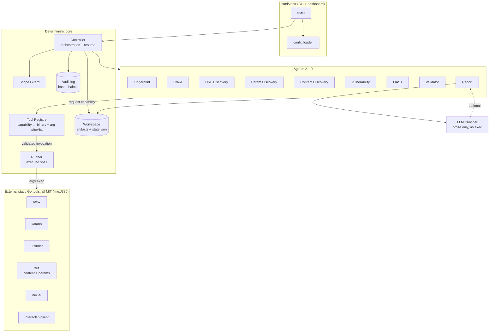
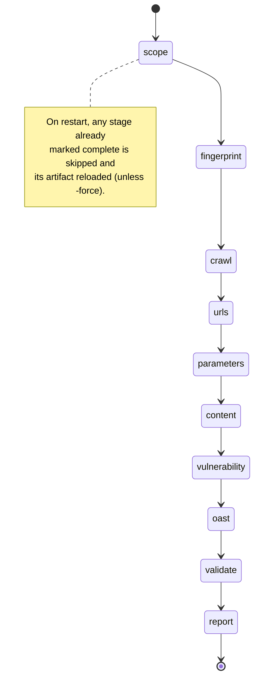

# Architecture

## 1. Overview

vmvapt is a **pipeline of ten independent agents** driven by a single
**deterministic controller**. Agents never call each other; they communicate
only through JSON artifacts in a confined **workspace**. This makes each stage
independently runnable, testable, and resumable, and keeps memory flat.

Two hard boundaries define the security posture:

- **The Tool Registry** is the only way to execute an external program.
- **The LLM** is confined to the report-narrative seam — it never drives control
  flow and never executes tools.

## 2. Component diagram



Key point: the arrow from agents to tools **always** passes through the registry
and runner. There is no path from an agent — or the LLM — directly to a shell.

## 3. Data-flow diagram

```mermaid
flowchart LR
    TGT([targets]) --> SG[Scope Guard]
    SG -->|scope.json<br/>approved[]| FP[HTTPX]
    FP -->|httpx.jsonl| CR[Katana]
    CR -->|katana.jsonl| UD[URL Discovery]
    UD -->|urls.json| PD[Param Discovery]
    PD -->|parameters.json| CD[Content Discovery]
    CD -->|content.json| VU[Nuclei]
    FP -.tech drives template selection.-> VU
    VU -->|findings.jsonl| OA[Interactsh/OAST]
    OA -->|findings.jsonl<br/>+ callbacks| VA[Validator]
    VA -->|deduped + scored| RP[Report]
    RP -->|report.json / .md / .html| OUT([deliverables])

    SG -. every decision .-> AUDIT[(audit.jsonl)]
    VU -. every invocation .-> AUDIT
```

Notes:

- **Fingerprint → Vulnerability** is a control edge, not a data-merge: detected
  technologies select a **bounded** Nuclei tag set (`exposure, misconfig, cve,
  default-login, tech` + per-tech tags). Nuclei is **never** run with the full
  template corpus.
- **OAST** rewrites `findings.jsonl` in place, promoting any finding correlated
  with an out-of-band callback to `verified`.
- **Validator** dedupes by `(template, url, matcher)` and assigns a conservative
  confidence state.

## 4. Stage checkpointing & resume

The controller records completed stages in `state.json`:



## 5. Threading the operator's limits

The `ScopeConfig.RateLimit` and `MaxConcurrency` are injected into **every** tool
invocation via `agents.rateArgs`, mapped to each tool's own flag names
(`-rate-limit`/`-rate`, `-threads`/`-c`/`-t`). No agent can forget to apply them
because the helper is the single construction site.

## 6. Memory & performance design

- **Streaming JSONL**: `eachJSONLine` parses tool output line-by-line with a
  bounded buffer; the whole result set is never held in memory twice.
- **stdlib-only**: no third-party Go modules → smaller binary, faster startup,
  no supply-chain surface.
- **No CGO**: fully static ELF; no dynamic linker needed inside v86.
- **Flat concurrency**: the controller runs stages sequentially (the tools
  themselves parallelize internally under the concurrency cap), keeping peak RSS
  predictable — important under the 512 MB target.

## 7. Package responsibilities

| Package | Responsibility | May execute? | Touches FS? |
|---|---|---|---|
| `model` | data types | no | no |
| `scope` | Agent 1 trust boundary | no | no |
| `registry` | capability → validated invocation | **builds** invocations | no |
| `runner` | exec argv (no shell) | **yes (only here)** | no |
| `workspace` | artifact + state I/O (jailed) | no | **yes (only here)** |
| `audit` | hash-chained log | no | via workspace |
| `agents` | Agents 2–10 | via registry+runner | via workspace |
| `controller` | orchestration, resume, scope gate | no | via workspace |
| `llm` | report prose | no | no |
| `config` | load + validate config | no | read config only |

This table is the whole security model in one glance: exactly one package can
exec, exactly one can touch arbitrary files, and neither is the LLM.
